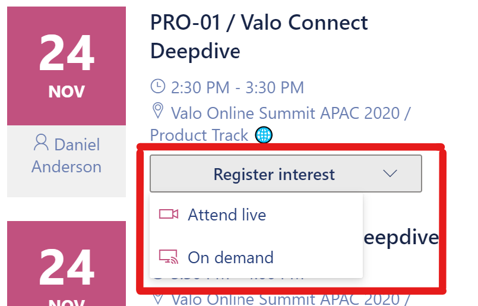

# valo-intranet-webcomponent-attendeelist

## Summary

This repo is an example of a Valo web component extension, based on extensibility pattern implemented in the [Valo Intranet Web Components repo](https://github.com/ValoIntranet/valo-intranet-webcomponents).

After building this SharePoint Framework solution, and deploying it to a SharePoint tenant where [Valo Intranet](https://www.valointranet.com/valo-intranet/) is installed, a new web component will be made available for use in Valo Universal Web Part templates.  Adding this markup to your Universal Web Part template will add the button included in this solution:

```HTML
<attendee-register calendar-identifier="abc-123" on-demand-url="/sites/video-hub/SitePages/Session-Video.aspx?SessionID={{ValoSessionVideoListItemId}}" play-button-text="Play video" play-button-icon="BoxPlaySolid" />
```



## Used SharePoint Framework Version


## Applies to

- [SharePoint Framework](https://aka.ms/spfx)
- [Microsoft 365 tenant](https://docs.microsoft.com/en-us/sharepoint/dev/spfx/set-up-your-developer-tenant)

> Get your own free development tenant by subscribing to [Microsoft 365 developer program](http://aka.ms/o365devprogram)

## Prerequisites

> Any special pre-requisites?

## Solution

Solution|Author(s)
--------|---------
vall-intranet-webcomponent-attendeelist | Mark Powney, Valo Intranet, [@mpowney](https://twitter.com/mpowney)

## Version history

Version|Date|Comments
-------|----|--------
1.0|December, 2020|Initial release

## Disclaimer

**THIS CODE IS PROVIDED *AS IS* WITHOUT WARRANTY OF ANY KIND, EITHER EXPRESS OR IMPLIED, INCLUDING ANY IMPLIED WARRANTIES OF FITNESS FOR A PARTICULAR PURPOSE, MERCHANTABILITY, OR NON-INFRINGEMENT.**

---

## Minimal Path to Awesome

- Clone this repository
- Ensure that you are at the solution folder
- in the command-line run:
  - **npm install**
  - **gulp serve**

> Include any additional steps as needed.

## References

- [Getting started with SharePoint Framework](https://docs.microsoft.com/en-us/sharepoint/dev/spfx/set-up-your-developer-tenant)
- [Building for Microsoft teams](https://docs.microsoft.com/en-us/sharepoint/dev/spfx/build-for-teams-overview)
- [Use Microsoft Graph in your solution](https://docs.microsoft.com/en-us/sharepoint/dev/spfx/web-parts/get-started/using-microsoft-graph-apis)
- [Publish SharePoint Framework applications to the Marketplace](https://docs.microsoft.com/en-us/sharepoint/dev/spfx/publish-to-marketplace-overview)
- [Microsoft 365 Patterns and Practices](https://aka.ms/m365pnp) - Guidance, tooling, samples and open-source controls for your Microsoft 365 development
- [Valo Intranet Web Components Extensibility](https://docs.valointranet.com/intranet/extend/extensibility/webcomponents/) - available for Valo partners, this documentation describes how to use Web Components in Valo Universal Web Part templates